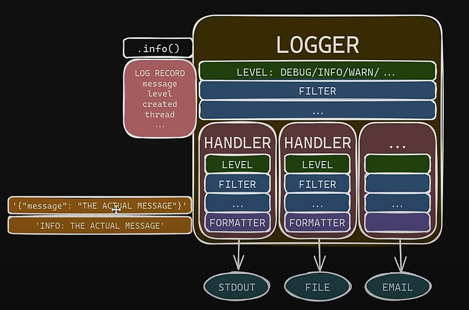

[Tutorial video](https://www.youtube.com/watch?v=9L77QExPmI0)

For most projects create a root-logger with all the handlers and create a new logger for each sub-project,since these won't have their own handler, they will pass over to the root handlers.

1. 0-stdout.json
`cons`
    - Traceback error is logged as it is,can programmatically read

2. 1-stderr-file.json
Now we log to both stdout and a file. But still exceptions can't be programmatically read from the log file. **store persistent logs in jsonl**, run main2.py for this

